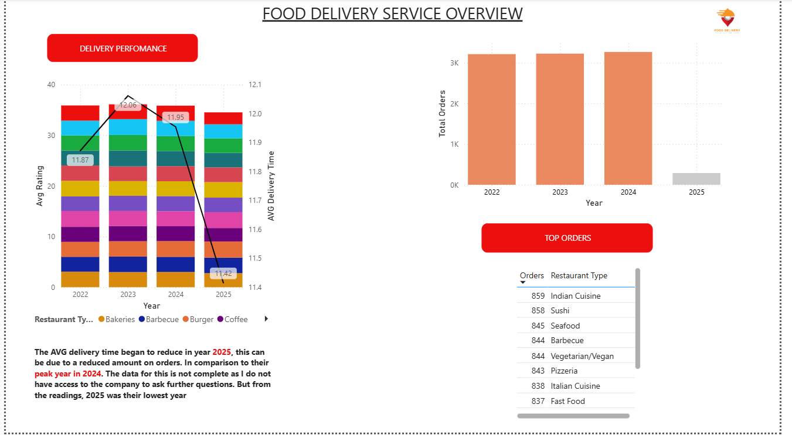
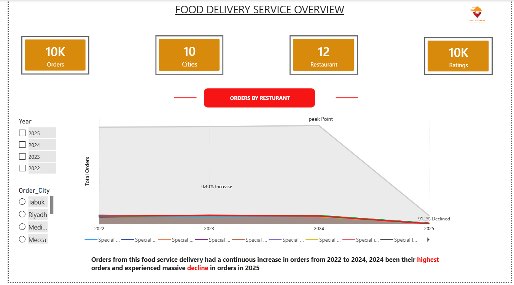
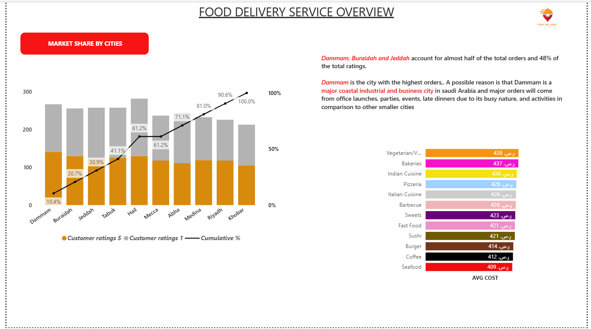

# SAUDI-ARABIA-FOOD-SERVICE-DELIVERY-PERFORMANCE-ANALYSIS-USING-EXCEL-AND-POWER-BI
## Overview
This project is an interactive Power BI dashboard developed to analyze the food service delivery performance, total number of orders, and revenue trends. The dashboard transforms raw order details data into visual insights to support business decision-making and performance tracking.

---

## Objectives
- Analyze overall orders and revenue performance
- Identify top-selling restaurant and categories
- Identifying cities with the highest orders
- Compare delivery time performance across countries/regions
- Analyzing ratings and reviews

---

## Dashboard Features
- 📈 Total Revenue KPI
- 🌍 Total orders by Country/Restaurants
- 📅 Average ratings and delivery time
- ⭐ Top-Selling country
- 🔍 Interactive Filters and Slicers

---

## Tools Used
- Power BI
- Power Query
- Excel

---

## Skills Demonstrated
- Data Cleaning and Transformation
- Data Visualization
- performance Trend Analysis
- Dashboard Design
- Business Insight Reporting

---

## Dashboard Preview

---
## Key Insights
- Identified top-performing countries contributing the highest orders
- Analyzed year growth and declined in revenue
- Highlighted best-selling restaurants and orders distribution patterns
- Improved visibility into decline in orders, revenue

---

## Project Files
- `Foodservicedeliveryoverview.pbix`
- `dashboard-screenshots.png`
- `README.md`

---

